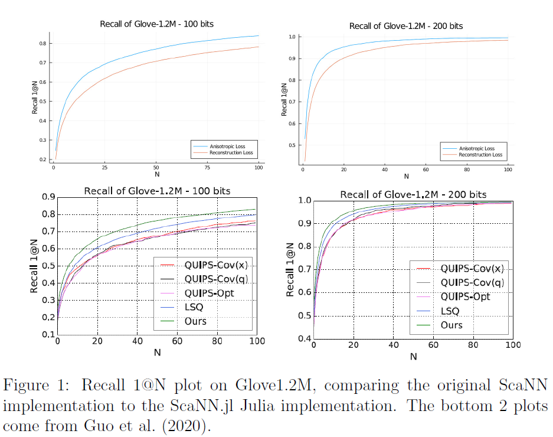

# AHPQ.jl

[](https://ci.appveyor.com/project/AxelvL/AHPQ-jl)
[](https://codecov.io/gh/AxelvL/AHPQ.jl) 

The Anisotropic Hierarchical Vector Quantizer, based on the Scalable Nearest Neighbours Algorithm (ScaNN).
Implemented as in the paper by Google Research (https://arxiv.org/abs/1908.10396) and the [SlidesLive presentation](https://slideslive.at/38928419/accelerating-largescale-inference-with-anisotropic-vector-quantization). Written 100% in Julia without any non-Julian dependencies. The `AHPQ.jl` package provides a highly configurable **Max Inner Product Search** (MIPS) system.

## Algorithm Overview
The current implementation can be perceived as a *Multi-D-ADC* set-up, or Vector Quantization tree (VQ-tree) trained with the *Anisotropic Loss* as the distance function, optimal for Max Inner Product Search. 

### Step 1: Preclustering
Preclustering (see image below) happens with the VQ step of *Multi-D-ADC* quantization (Baranchuk et al., 2018). The codebook is trained on `n_clusters_to_generate` centres (a configurable hyperparameter) with the anisotropic loss function.


### Step 2: Anisotropic Product Quantization
After the first step, the residuals of the data points with respect to their assigned groups are computed. The Anisotropic Product Quantizer is trained on these using `n_codebooks` of `n_centers` each (both configurable hyperparameters). 


### Step 3: Reordering
The final residuals of the data points with respect to step 1 and step 2 are indexed in the last step for an exact reordering. The number of items to be re-ranked using the exact distance can be configurd with `reorder`.


### Searching
At searching time the `searcher` goes through the following three main steps:
1. Asymmetric distance computation to the `n_clusters_to_generate` clusters found in VQ pre-processing phase;
    *  Intermediate ranking: Selecting the top `n_clusters_to_inspect` centers with the most potential (smallest distance), retrieve the indices of the points assigned to these centers from the inverted indexer to further prune them. 
2. Compute approximate asymmetric inner products using the quantized database by adding the inner products to the distances found in step 1;
    * Intermediate ranking:  rank the data points by their updated dis-tance approximation.
3.  Recompute the top `reorder` inner products from the ranking using exact computation of the inner products with the residuals generated in the third step from data generation.
    * Final ranking: sort the `reorder` exact distances to get the `k` nearest neighbors.


### Configuration Arguments
For a complete overview of configurable parameters see the [configurations](./docs/configs.md) file. 

## Installation and Use
The package can be installed in a running Julia environment with the standard
package manager:
```julia
using Pkg
Pkg.add(PackageSpec(url="https://github.com/AxelvL/AHPQ.jl", rev="master"))
```

After installing the package, a searcher has to be constructed for your training set. To start the constructor, the `n_codebooks` codebooks and `n_clusters` centres (see images above) need to be defined as keyword arguments. If a second Float parameter (`T`, in the [original paper](https://arxiv.org/abs/1908.10396)) is provided before the keyword arguments, the searcher will be trained on anisotropic loss. Without the parameter, the builder will assume training on L2-distance.

The example
below constructs the searcher for an artificial data set:

```julia
traindata = rand(d, n)
l2_searcher          = builder(traindata; n_codebooks=50,
                                          n_centers=16)
anisotropic_searcher = builder(traindata, 0.2; n_codebooks=50,
                                               n_centers=16)
```

After having constructed the searcher, the MIPS function can be used to handle a single query or a batch of queries.  The searcher will return `k` nearest neighbours' indexes (provided as a parameter).

```julia
queries = rand(n_dim, n_queries)
k_nn       = MIPS(anisotropic_searcher, queries[:, 1],  k)   
k_nn_batch = MIPS(anisotropic_searcher, queries, k)
```

For training and benchmarking purposes a set of testing metrics is available. The `recallN` and `recall1atN` functions are implemented. As input it takes the batch results from the previous operation, as well as a ground truth:

```julia
println("Recall 100@100 score:")
@show recallN(k_nn_batch, gt, 100)

println("\nRecall 1@100 score:")
@show recall1atN(k_nn_batch, gt, 100)
```

### Example Use
The following graph shows that the implementation shows parallel quantization performance to the [original C/Python library](https://github.com/google-research/google-research/tree/master/scann/scann):



See the public colab notebooks to see how these graphs were produced. See [this notebook](./docs/example_artificialdata.ipynb) to see a complete example notebook on artificial data.

## Future to do's
* Improve querying performance by implementing using cache friendly 16-bit lookup-tables and corresponding in-cache LUT16 methods (Wu et al., 2019)
* Implement batching


***

## References:
* Baranchuk, D., Babenko, A., and Malkov, Y. (2018). Revisiting the invertedindices for billion-scale approximate nearest neighbors.  In *Proceedings  ofthe European Conference on Computer Vision (ECCV)*, pages 202–216.
* Guo, R., Sun, P., Lindgren, E., Geng, Q., Simcha, D., Chern, F., and Kumar,
S. (2020). Accelerating large-scale inference with anisotropic vector
quantization. In *Proc. of the 37th International Conference on Machine
Learning*;
* Wu, X., Guo, R., Simcha, D., Dopson, D., and Kumar, S. (2019). Efficient inner product approximation in hybrid spaces. *arXiv preprint
arXiv:1903.08690*

