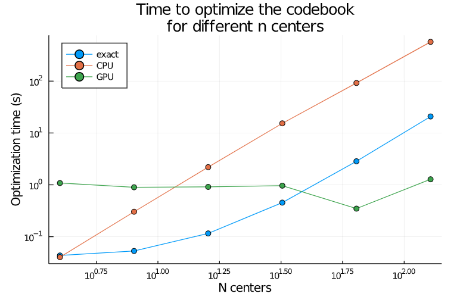

# Builder Configurations

## Main Configurations
* `T::AbstractFloat` Threshold parameter of the Anisotropic loss function (see [original paper](https://arxiv.org/abs/1908.10396) for full explanation). Set this parameter to 0 to use L2 loss instead. It is recommended to tune the value for `T` on a subsample of the dataset. 

The following values will control the efficiency/accuracy trade-off for the Hierarchical Product Quantization tree.
 * `n_codebooks::Int=n_dims/2` number of codebooks to train
 * `n_centers::Int=8` number of clusters/centers to train
 * `a::Int=√n_dp` number of partitions generated in preclustering step, set to 0 to turn off
 * `b::Int=(n_clusters_to_generate ÷ 5 + 2)` number of partitions pruned from preclustering step
 * `reorder::Int=0` number of datapoints used for exact inner product reordering

Higher values for `n_codebooks` and `n_centers` will yield more accurate results at the searching stage at the cost of querying speed.

The same holds for higher values of `a` and `b`: the higher the number of centers generated and searched, the higher the probability that the true nearest neighbor is found - at the cost of speed. Note that turning this off (setting to 0) creates the most accurate searcher. Setting `a` and `b` to lower values may drastically increase querying speed. 

`reorder` is a powerful configuration to find the true nearest neighbour within the final approximate selection at the cost of speed. Tune according to recall target and number of neighbours required or turn off using `reorder=0`.

Setting `a = sqrt(n)` is [recommended](https://github.com/google-research/google-research/blob/master/scann/docs/algorithms.md) for maintaining optimal accuracy while improving speed. `b` should be tuned based on recall target.

## Other Training Configurations
 * `T_preclustering::Int=-1` the `T` parameter for the preclustering loss function, set to -1 to use the same value as for `T`, to 0 to use L2_loss
or to a value 0 < `T_preclustering` < 1 to use a custom Threshold value for partitioning.

 * `initialise_with_euclidean_loss::Bool=true` switches euclidean pre-training on/off. Can be used as a strategy to speed up AHPQ training.
 * `inverted_index::Bool=true` switches to IVF methods for Euclidean quantization. Can be used as a strategy to speed up L2-based (pre-)training if the number of `n_clusters` is relatively low to the `n_dp`.
 * `max_iter::Int=1000` the max number of iterations of the assignment_step-codebook_update loop. 
 * `stopcond<:AbstractFloat=1e-2` the stopcondition (l2-distance of codebook update) for the assignment_step-codebook_update loop. Set to `0` to train on a `max_iter` iterations instead.
 * `verbose::Bool=false` switches training information updates on/off.
 * `max_iter_assignments::Int=10` maximum iterations for the approximate (coordinate descent) assignment step of anisotorpic quantization.
 * `optimisation::String="exact"` the optimisation method for the codebook udpate step, takes: ("exact", "nesterov").
 * `multithreading::Bool=false` switches multi-threading on/off.
* `increment_steps::Int=floor(log10(training_points))-2)` number of incremental steps, use 0 to switch off incremental training. Powerful strategy to lower training time without losing much accuracy.
* `training_points::Int=ceil(n_dp/5))` number of training points to train on. Can be used to increase querying accuracy or to speed up training.
 * `GPU::Bool=false` switches optimization on GPU on/off (uses CUDA.jl). Drastically speeds up training in a scenario where the `n_clusters` is relatively high (high recall scenarios). See the following plot (example for `n=10.000, d=100`)

